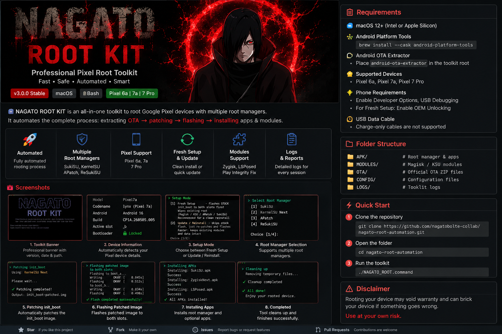

<p align="center">
  
</p>

<h1 align="center">NAGATO ROOT KIT</h1>

<p align="center">
Professional Google Pixel Root Automation Toolkit
</p>

<p align="center">


</p>

---

# 🚀 Overview

NAGATO ROOT KIT is a professional automation toolkit designed for rooting Google Pixel devices on macOS.

Instead of manually performing every step, the toolkit automates nearly the entire workflow:

- Device Detection
- OTA Selection
- init_boot Extraction
- APK Detection
- Module Detection
- Root Manager Selection
- Flashing
- Cleanup
- Logging

Everything is designed to reduce manual work while keeping the process transparent.

---

# ✨ Features

## Device Detection

✔ Automatic Pixel detection

✔ Detects:

- Model
- Codename
- Android Version
- Build Number
- Active Slot
- Bootloader State

---

## OTA Detection

Automatically finds the newest OTA matching the connected device.

Example:

```
lynx-ota-xxxxxxxx.zip
```

No manual editing required.

---

## Supported Root Managers

- SukiSU
- KernelSU Next
- APatch
- ReSukiSU

Select the preferred root manager directly from the toolkit.

---

## Fresh Setup Mode

Recommended when changing root manager.

Automatically:

- flashes stock init_boot
- removes previous root
- waits for USB debugging
- continues automatically

---

## Update / Reinstall Mode

Keeps existing setup while updating root.

Perfect for:

- updating KernelSU
- changing modules
- updating apps

---

## Automatic APK Detection

No hardcoded filenames.

The toolkit automatically selects the newest matching APK.

Supported:

- SukiSU
- KernelSU
- APatch
- ReSukiSU
- Telegram
- Android ID Editor
- HMA OSS
- NAGATO App

---

## Automatic Module Detection

Automatically detects:

- Zygisk Next
- LSPosed
- Play Integrity Fix
- Tricky Store
- Yurikey

Newest versions are always preferred.

---

## Automatic Config Detection

Automatically loads supported configuration files.

---

## Automatic Patch Detection

After patching on the phone:

```
init_boot.img
```

the toolkit automatically detects the patched image.

No filename editing required.

---

## Automatic Cleanup

After successful flashing:

Removes

- payload.bin
- init_boot.img
- patched image

from both:

- Mac
- Phone

keeping the workspace clean.

---

## Logging

Every session is logged.

Useful for debugging and troubleshooting.

---

# 📱 Supported Devices

| Device | Codename |
|---------|-----------|
| Pixel 6a | bluejay |
| Pixel 7a | lynx |
| Pixel 7 Pro | cheetah |

---

# 💻 Requirements

See:

- REQUIREMENTS.md

---

# 📂 Project Structure

```
NAGATO ROOT KIT
│
├── APK
├── MODULES
├── OTA
├── CONFIG
├── LOGS
├── assets
├── docs
│
├── banner.sh
├── checks.sh
├── config.sh
├── device.sh
├── logger.sh
├── menu.sh
├── root_pixel.sh
├── NAGATO_ROOT.command
│
├── README.md
├── REQUIREMENTS.md
├── CHANGELOG.md
├── CONTRIBUTING.md
├── SECURITY.md
└── LICENSE
```

---

# ⚠ Disclaimer

This project is intended for educational and development purposes.

Rooting, unlocking the bootloader, or flashing images may void warranties or lead to data loss. Always ensure you have backups and use files that match your device and build.

---

# 📜 License

MIT License
